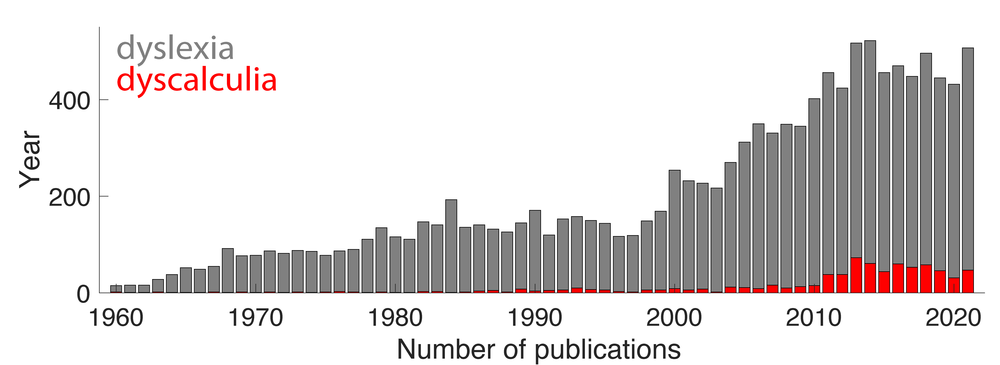

## What is dyscalculia? 
**Developmental dyscalculia** is a specific learning difficulty affecting the acquisition of elementary mathematical skills, such as:
* **Quantity processing** (e.g. estimating the number of spectators in a stadium) 
* **Calculation** (e.g. solving '53-14=39' without paper)
* **Arithmetic facts** (e.g. the multiplication table) 
* **Geometrical reasoning** (e.g. comparing the angles of a triangle). 

Children with dyscalculia struggle in these domains, despite intellectual ability, typical neurological development, and strong educational opportunity.

* [**Dyscalculia affects 3-6% of the population**, similar to dyslexia.](shalev_prevalence.pdf) 
* [**Low numeracy** is associated with poor financial well-being.](low_numeracy.pdf) 
* [**Improvement** by one standard deviation in **math proficiency translates into 12% increase in wages**.](https://www.oecd.org/skills/piaac/Country%20note%20-%20United%20States.pdf)

Low numeracy is estimated to have similar or potentially higher costs to individuals and society compared to low literacy. Yet, dyscalculia is studied disproportionately less than dyslexia. This disparity is reflected in the number of publications on [PubMed](https://pubmed.ncbi.nlm.nih.gov/) for dyslexia vs. dyscalculia over time. See below:

#### Explore the most active brain regions for elementary math:
*(**try changing "inflated" to "pial"**)*

  <iframe id="inlineFrameExample"
      title="Inline Frame Example"
      width="800"
      height="600"
      src="surface_math.html"
      frameBorder="0"
      class="center">
  </iframe>

*(This data is an automated meta-analysis created with [**NeuroSynth**](https://neurosynth.org/analyses/terms/arithmetic/), based on [96 fMRI studies](https://neurosynth.org/analyses/terms/arithmetic/#studies))*

### Co-occurence between math and reading difficultites

Current research suggests that learning difficulties rarely occur in isolation and are therefore better conceptualized as a collection of phenotypes involving a variety of academic domains. Recent studies have demonstrated that 40-60% of children with **dyslexia** also present with math difficulties. 

#### Explore how the  math (blue) and  reading (green) brain networks overlap (red) in the left hemisphere:

  <iframe id="inlineFrameExample"
      title="Inline Frame Example"
      width="800"
      height="600"
      src="surface_math_reading_left.html"
      frameBorder="0"
      class="center">
  </iframe>

**Explore the maps across brain slices**:

  <iframe id="inlineFrameExample"
      title="Inline Frame Example"
      width="400"
      height="350"
      src="slices_combined3.html"
      frameBorder="0"
      class="center">
  </iframe>

**How to read the brains**:

<!--
**Note that left hemisphere contains many more regions dedicated to reading!**

#### Compare this to the right hemisphere:
This is the middle of the brain, try moving it around!

  <iframe id="inlineFrameExample"
      title="Inline Frame Example"
      width="2000"
      height="600"
      src="surface_math_reading_right.html"
      frameBorder="0"
      class="center">
      default='right'
  </iframe>

-->

**Summary of the main regions engaged during math reasoning**:

### Currently, there is no consensus about: 
* [The diagnostic criteria for dyscalculia](/math_battery)
* [The most effective interventions](/interventions)

### But our multidisciplinary [team](/team) at UCSF is working on it! 
For more information about the science of dyscalculia, see our list of [**Publications**](/publications) and 
**Prof. Pinheiro-Chagas'** slides for the event **Neuroscience in Action** on Sep 30th 2022 below:

<iframe src="https://www.slideshare.net/slideshow/embed_code/key/dUqlwmsnU9En9J?hostedIn=slideshare&page=upload" width="1100" height="620" frameborder="0" marginwidth="0" marginheight="0" scrolling="no" class="center"></iframe>