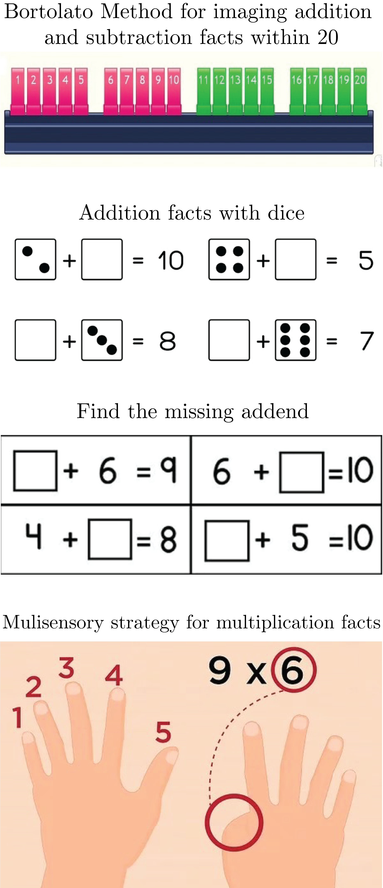

## Math interventions

### What are math intervetnions? 
Pedadagogical intervetnions specifically designed...

#### Do they work?
Here is a summary of the most popular interventions used:

### What are their limitations?
* Small number of studies
* Lack of replication in diverse populations
* Small effect sizes

### How can we make them more effective?
* Neuroscience based
* Poverty Lab model to conduct randomized control trials
