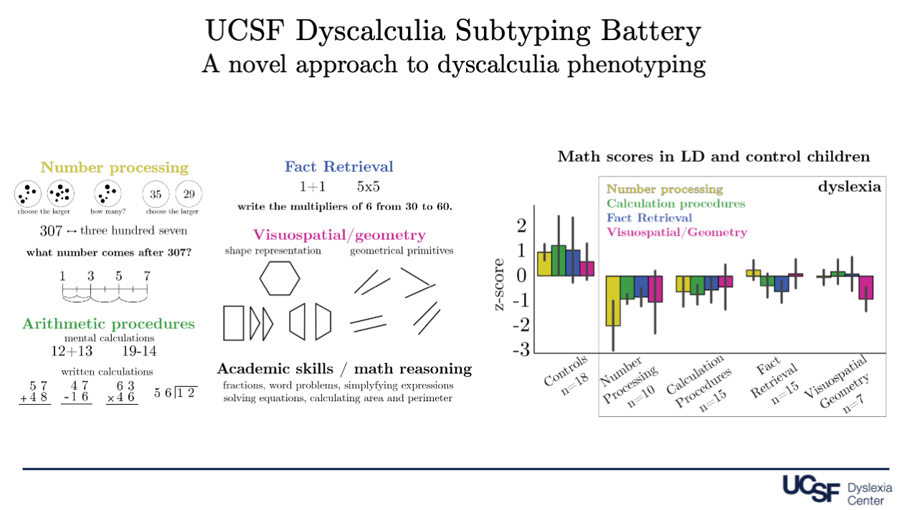

## UCSF Dyscalculia Subtyping Battery

### How to identify specific math learning differences in children

There is currently no consensus about the different subtypes of math learning differences in children. Therefore, it is currently very challening for clinicians to diagnose [developmental dyscalculia](/dyscalculia).

Based on extensive neuroscientific literature (see publications below) that has identified partially dissociable brain networks for different math domains, we created the **The UCSF Dyscalculia Subtyping Battery (DSB)**. 

We have already piloted the UCSF-DSB in over **250** students from grades 2 to 8. Our results demonstrate that the UCSF-DSB can reliable identify four subtypes of math learning differences:

* **Number processing**
* **Arithmetic procedures**
* **Arithmetic fact retrieval**
* **Geometrical/Visuospatial abilities**

## [Checkout our preprint here!](https://assets.researchsquare.com/files/rs-1922020/v1_covered.pdf?c=1663797842) 

### See below example items from the subtests of the UCSF-DSB:

In addition to elementary math abilities, the UCSF-DSB also targets:

* **Complex math skills** (e.g. simplifying expressions, solving equations)
* **Teaching exposure** (which could potentially explain the child's difficulties)

## Next Steps

### Develop a simplified UCSF web-based math battery to identify children at risk for math learning differences prior to elementary school.  

### Key references that guided the development of the UCSF-DSB:

* [The Mathematical Brain](butterworth_1999.pdf)
* [The Number Sense: How the Mind Creates Mathematics](dehaene_1997.pdf)
* [Numerical and arithmetical deficits in learning- disabled children: Relation to dyscalculia and dyslexia](geary_and_howard_2001.pdf)
* [Cognitive mechanisms in numerical processing: Evidence from acquired dyscalculia](mccloskey_1992.pdf)
* [Cognitive Mechanisms in Number Processing and Calculation: Evidence from Dyscalculia](mccloskey_1985.pdf)
* [Developmental Dyscalculia: heterogeneity might not mean different mechanisms](rubinstein_and_henik.pdf)
* [Digit dyslexia: A Category-specific disorder in development dyscalculia](temple_1989.pdf)
* [Number development and developmental dyscalculia](vonaster_and_shalev.pdf)

