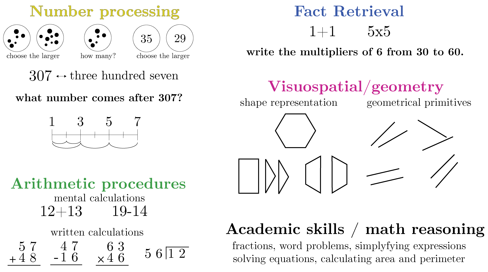

## Math assessment 

### How can we assess math abilities in children? 

There is currently no agreed-upon picture of the cognitive profiles of children with a specific learning disorder in mathematics. This contributes to the fact that, despite the efforts by cognitive researchers, existing diagnostic assessments seem to still be inadequate.

Converging evidence from several research groups ([Butterworth, 1999](butterworth_1999.pdf); [Dehaene, 1997](dehaene_1997.pdf); [Geary & Hoard, 2001](geary_and_hoard_2001.pdf); [McCloskey, 1992](mccloskey_1992.pdf); [McCloskey et al., 1985](mccloskey_1985.pdf); [Rubinsten & Henik, 2009](rubinstein_and_henik.pdf); [Temple, 1989](temple_1989.pdf); [Von Aster & Shalev, 2007](vonaster_and_shalev.pdf)) highlighted the key role of four basic cognitive and neural domains in the acquisition of mathematical skills: number processing, calculation, arithmetic facts retrieval and geometrical abilities.

***The UCSF Dyscalculia Subtyping Battery (DSB)*** has been designed to comprehensively assess these four mathematical domains.  

The DSB has been experimented with over **250** students. First results suggest the existence of at least four subtypes of developmental dyscalculia according to the mathematical impairment to which it is related: **dyscalculia in number processing**, **dyscalculia in calculation**, **dyscalculia in arithmetic facts**, and **dyscalculia in geometry**.

### [Checkout our preprint here!](https://assets.researchsquare.com/files/rs-1922020/v1_covered.pdf?c=1663797842) 

### UCSF Dyscalculia Subtyping Battery (DSB)

The UCSF Dyscalculia Subtyping Battery (DSB) is a novel assessment aiming at identifying deficits in four distinct mathematical domains: 
* **number processing**
* **calculation**
* **arithmetic facts retrieval**
* **geometrical abilities**

The DSB is designed for students from the 2nd to the 8th grade with seven different forms based on grade level. 

Overall, it includes 4 computer-based subtests and 12 paper-based subtests targeting number processing, calculation, arithmetic facts retrieval and geometrical abilities. In addition, 8 subtests are included to evaluate more complex mathematical skills (e.g, simplifying expressions, solving equations and geometrical problems) and to verify adequate teaching exposure (the lack of which would prevent a diagnosis of learning difference in mathematics).

Subtests aiming to identify deficits in ***number processing*** include subitizing, ANS and counting principles, comparisons, ordering, and transcoding between number digits and number words. 
Subtests aiming to identify deficits in ***calculation*** contain mental additions and subtractions, as well as written calculations involving all four operations. 
Subtests aiming to identify deficits in ***arithmetic facts*** retrieval include the evaluation of arithmetic facts knowledge, in particular multiplication tables.
Subtests aiming to identify deficits in ***geometrical abilities*** include tasks requiring (1) processing distances and directions, targeting visuospatial ability (2) matching shapes presented in different orientations or decomposed to demonstrate visuoperceptual ability, and (3) mental rotations of 2D and 3D objects to assess visuoconstructional functions ([Bruce & Hawes, 2015](bruce_and_hawes_2015.pdf)). 

### See below some examples of subtests from the DSB:

#### Number Subtests

* Order the following numbers from least to greatest. Connect each of them with a point on the number line.  

* What is the set with most dots?  

#### Calculation Subtests

* Subtract the two numbers  

* Perform the operation  

#### Arithmetic Facts Retrievel Subtests

* Find the product of the two numbers  

#### Geometrical Abilities Subtests

* Find the set of figures that matches the target shape  

* Which is the intruder?  

